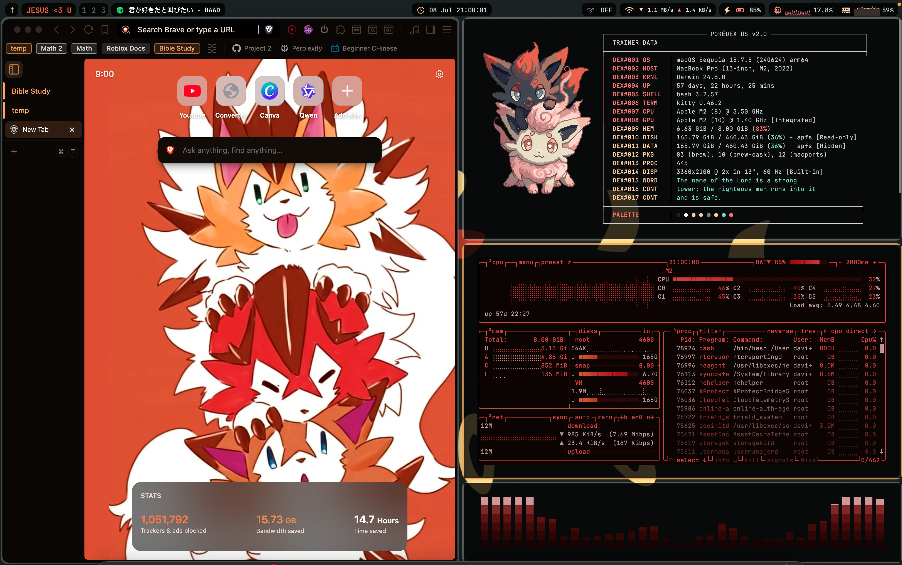
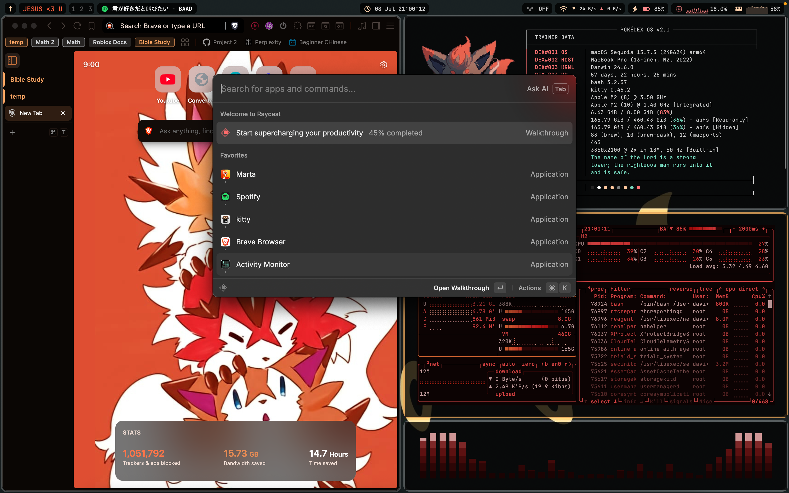
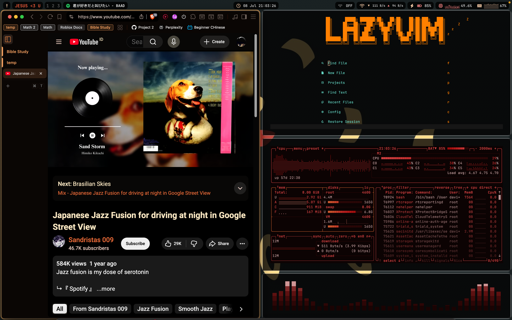

# dotfiles — macOS Rice

Personal macOS ricing setup managed with [GNU Stow](https://www.gnu.org/software/stow/).

## Gallery

<div align="center">
  
  <br/><br/>
  
  <br/><br/>
  
</div>

## Stack

| Category | Tool |
|---|---|
| Window manager | [yabai](https://github.com/koekeishiya/yabai) |
| Hotkeys | [skhd](https://github.com/koekeishiya/skhd) |
| Menu bar | [SketchyBar](https://github.com/FelixKratz/SketchyBar) |
| Window borders | [borders](https://github.com/FelixKratz/borders) |
| Terminal | [Kitty](https://sw.kovidgoyal.net/kitty/) |
| Shell | [Fish](https://fishshell.com/) |
| Prompt | [Starship](https://starship.rs/) |
| Editor | [Neovim](https://neovim.io/) (LazyVim) |
| System fetch | [fastfetch](https://github.com/fastfetch-cli/fastfetch) — PokéDEX themed |
| System monitor | [btop](https://github.com/aristocratos/btop) |
| Audio visualizer | [cava](https://github.com/karlstav/cava) |
| Process viewer | [bottom](https://github.com/ClementTsang/bottom) |
| Music | Spotify + [spicetify](https://spicetify.app/) |

All configs share a cohesive dark palette with **day/night theme switching** (warm peach/orange by day, deep red/crimson by night).

## Installation

```bash
git clone git@github.com:DavLyc/dotfiles.git ~/dotfiles
cd ~/dotfiles
./install.sh
```

This will install all Homebrew packages and symlink configs into place.

To symlink manually:

```bash
stow yabai
stow skhd
stow sketchybar
stow borders
stow kitty
stow nvim
stow fish
stow fastfetch
stow cava
stow btop
stow bottom
stow themes
stow spicetify
```

## Structure

Each directory is a Stow package that mirrors `$HOME`:

```
dotfiles/
├── yabai/       → ~/.config/yabai/
├── skhd/        → ~/.config/skhd/
├── sketchybar/  → ~/.config/sketchybar/
├── borders/     → ~/.config/borders/
├── kitty/       → ~/.config/kitty/
├── nvim/        → ~/.config/nvim/
├── fish/        → ~/.config/fish/
├── fastfetch/   → ~/.config/fastfetch/
├── cava/        → ~/.config/cava/
├── btop/        → ~/.config/btop/
├── bottom/      → ~/.config/bottom/
├── themes/      → ~/.config/themes/
├── spicetify/   → ~/.config/spicetify/
├── Brewfile
├── install.sh
└── README.md
```
If there are any bugs, let me know

## Editor's Note
- The theme should switch between day (orange) and night (red), but so far you can only do this manually
-

